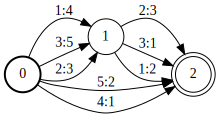
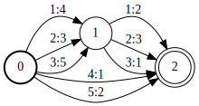
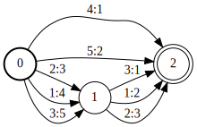

# ArcSort

## Description

This operation sorts the arcs in an FST per state.

At the C++ level, the sort order is determined by a function object `compare` of
type `Compare`. Comparsion function objects `ILabelCompare` and `OLabelCompare`
are provided by the library. In general, `Compare` must meet the
[requirements](https://en.cppreference.com/w/cpp/named_req/Compare.html) for a
[`std::sort`](https://en.cppreference.com/w/cpp/algorithm/sort.html) comparison
functor. It must also have a member `Properties(uint64)` that specifies the
known properties of the sorted FST; it takes as argument the input FST's known
properties before the sort.

At the shell level, the sort order is determined by the `--sort_type` flag,
which can have values `ilabel` and `olabel`.

## Usage

```cpp
template <class Arc, class Compare>
void ArcSort(MutableFst<Arc> *fst, Compare compare);
```

```cpp
template <class Arc, class Compare> ArcSort<Arc, Compare>
ArcSortFst(const Fst<Arc> &fst, const Compare &compare);
```

[`ArcSortFst`](https://www.openfst.org/doxygen/fst/html/classfst_1_1ArcSortFst.html)

```bash
fstarcsort [--opts] a.fst out.fst
  --sort_type: ilabel (def) | olabel
```

## Examples

### A:



### Input Label Sort of A:



```cpp
ArcSort(&A, ILabelCompare<Arc>());
ArcSortFst<Arc, ILabelCompare<Arc> >(A, ILabelCompare<Arc>());
```

```bash
fstarcsort --sort_type=ilabel a.fst a-ilabel-sorted.fst
```

### Output Label Sort of A:



```cpp
ArcSort(&A, OLabelCompare<Arc>());
ArcSortFst<Arc, OLabelCompare<Arc> >(A, OLabelCompare<Arc>());
```

```bash
fstarcsort --sort_type=olabel a.fst a-olabel-sorted.fst
```

## Complexity

`ArcSort`:

*   Time: $O(V D \log D)$
*   Space: $O(D)$

where $V$ = # of states and $D$ = maximum
[out-degree](glossary.md#out-degree).

`ArcSortFst:`

*   Time: $O(v d \log d)$
*   Space: $O(d)$

where $v$ = # of states visited, $d$ = maximum out-degree of the states
visited. Constant time and space to visit an input state or arc is assumed and
exclusive of [caching](advanced_usage.md#caching).
