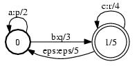

# Closure

## Description

This operation computes the concatenative closure. If `A` transduces string `x`
to `y` with weight `a`, then the closure transduces `x` to `y` with weight `a`,
`xx` to `yy` with weight $a \otimes a$, `xxx` to `yyy` with weight $a \otimes
a \otimes a$, etc. If `closure_type` is `CLOSURE_STAR`, then the empty string
is transduced to itself with weight $1$ as well.

## Usage

```txt
enum ClosureType { CLOSURE_STAR, CLOSURE_PLUS };
```

```cpp
template<class Arc>
void Closure(MutableFst<Arc> *fst, ClosureType type);
```

```cpp
template <class Arc> ClosureFst<Arc>::
ClosureFst(const Fst<Arc> &fst, ClosureType type);
```

[`ClosureFst`](https://www.openfst.org/doxygen/fst/html/classfst_1_1ClosureFst.html)

```bash
fstclosure [--opts] a.fst out.fst
  --closure_type: closure_star (def) | closure_plus
```

## Examples

### A:


### A*:


```bash
Closure(&A, CLOSURE_STAR);
ClosureFst<Arc>(A, CLOSURE_STAR);
fstclosure a.fst out.fst
```

### A+:



```bash
Closure(&A, CLOSURE_PLUS);
ClosureFst<Arc>(A, CLOSURE_PLUS);
fstclosure --closure_plus a.fst out.fst
```

## Complexity

`Closure`:

*   Time: $O(V)$
*   Space: $O(V)$

where $V$ = # of states and $E$ = # of arcs.

`ClosureFst:`

*   Time: $O(v)$
*   Space: $O(v)$

where $v$ = # of states visited, $e$ = # of arcs visited. Constant time to
visit an input state or arc is assumed and exclusive of
[caching](advanced_usage.md#caching).
