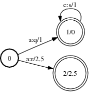
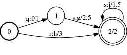
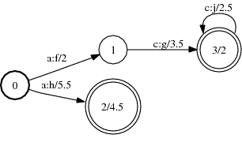

# Compose

## Description

This operation computes the composition of two transducers. If `A` transduces
string `x` to `y` with weight `a` and `B` transduces `y` to `z` with weight `b`,
then their composition transduces string `x` to `z` with weight $a \otimes b$.

The output labels of the first transducer or the input labels of the second
transducer must be [sorted](arc_sort.md) (or the FSTs otherwise support
appropriate [matchers](quick_tour.md#matcher)). The weights need to form a
[commutative semiring](weight_requirements.md) (valid for `TropicalWeight` and
`LogWeight` for instance).

Versions of this operation (not all shown here) accept
[options](advanced_usage.md#operation-options) that allow choosing the
[matcher](advanced_usage.md#matchers),
[composition filter](advanced_usage.md#composition-filters),
[state table](advanced_usage.md#state-tables) and, when delayed, the
[caching behavior](advanced_usage.md#caching) used by composition.

## Usage

```cpp
template <class Arc>
void Compose(const Fst<Arc> &ifst1, const Fst<Arc> &ifst2, MutableFst<Arc> *ofst);
```

```cpp
template <class Arc> ComposeFst<Arc>::
ComposeFst(const Fst<Arc> &fst1, const Fst<Arc> &fst2);
```

[`ComposeFst`](https://www.openfst.org/doxygen/fst/html/classfst_1_1ComposeFst.html)

```bash
fstcompose [--opts] a.fst b.fst out.fst
  --connect: Trim output (def: true)
```

## Examples

### A:



### B:



### A o B:



```bash
Compose(A, B, &C);
ComposeFst<Arc>(A, B);
fstcompose a.fst b.fst out.fst
```

## Complexity

Assuming the first FST is unsorted and the second is sorted:

`Compose`:

*   Time: $O(V_1 V_2 D_1 (\log D_2 + M_2))$
*   Space: $O(V_1 V_2 D_1 M_2)$

where $V_i$ = # of states, $D_i$ = maximum
[out-degree](glossary.md#out-degree) and $M_i$ = maximum
[multiplicity](glossary.md#multiplicity) for the *ith* FST.

`ComposeFst`:

*   Time: $O(v_1 v_2 d_1 (\log d_2 + m_2))$
*   Space: $O(v_1 v_2)$

where $v_i$ = # of states visited, $d_i$ = maximum out-degree, and $m_i$ =
maximum multiplicity of the states visited for the *ith* FST. Constant time and
space to visit an input state or arc is assumed and exclusive of
[caching](advanced_usage.md#caching).

## Caveats

`Compose` and `fstcompose` [trim](glossary.md#trim) their output, `ComposeFst`
does not (since it is a [delayed](glossary.md#delayed) operation).

The efficiency of composition can be strongly affected by several factors:

*   the choice of which transducer is sorted

*   prefer sorting the FST that has the greater average
    [out-degree](glossary.md#out-degree)

*   sorting both transducers allows composition to automatically select the best
    transducer to match against (per state pair)

*   note stored sort [properties](advanced_usage.md#properties) of the FSTs are
    first checked in constant time followed by the minimum number of linear-time
    sort tests necessary to discover one sorted FST; thus composition may be
    unaware that both FSTs are sorted when those properties are not stored.

*   the amount of non-determinism

*   the presence and location of [epsilon](glossary.md#epsilon) transitions -
    avoid epsilon transitions on the output side of the first transducer or the
    input side of the second transducer or prefer placing them later in a path
    since they delay matching and can introduce
    [non-coaccessible](glossary.md#co-accessible) states and transitions

See [here](efficiency.md#algorithm-specific-issues) for more discussion on
efficient usage.

## See Also

[Composition Filters](advanced_usage.md#composition-filters),
[Matchers](advanced_usage.md#matchers),
[State Tables](advanced_usage.md#state-tables)
