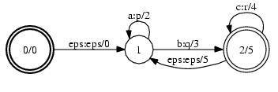
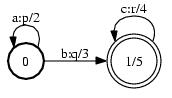
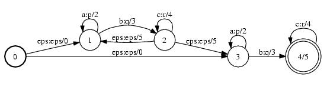

# Concat

## Description

This operation computes the concatenation (*product*) of two FSTs. If `A`
transduces string `x` to `y` with weight `a` and `B` transduces string `w` to
`v` with weight `b`, then their concatenation transduces string `xw` to `yv`
with weight $a \otimes b$.

## Usage

```cpp
template <class Arc>
void Concat(MutableFst<Arc> *fst1, const Fst<Arc> &fst2);
```

```cpp
template <class Arc>
void Concat(const Fst<Arc> &fst1, MutableFst<Arc> *fst2);
```

```cpp
template <class Arc> ConcatFst<Arc>::
ConcatFst(const Fst<Arc> &fst1, const Fst<Arc> &fst2);
```

[`ConcatFst`](https://www.openfst.org/doxygen/fst/html/classfst_1_1ConcatFst.html)

```bash
fstconcat a.fst b.fst out.fst
```

## Examples

### A:



### B:



### AB:



```bash
Concat(&A, B);
Concat(A, &B);
ConcatFst<Arc>(A, B);
fstconcat a.fst b.fst out.fst
```

## Complexity

`Concat(&A, B)`:

*   Time: $O(V_1 + V_2 + E_2)$
*   Space: $O(V_1 + V_2 + E_2)$

where $V_i$ = # of states and $E_i$ = # of arcs of the *ith* FST.

`Concat(A, &B)`:

*   Time: $O(V_1 + E_1)$
*   Space: $O(V_1 + E_1)$

where $V_i$ = # of states and $E_i$ = # of arcs of the *ith* FST.

`ConcatFst:`

*   Time: $O(v_1 + e_1 + v_2 + e_2)$
*   Space: $O(v_1 + v_2)$

where $v_i$ = # of states visited and $e_i$ = # of arcs visited of the *ith*
FST. Constant time and space to visit an input state or arc is assumed and
exclusive of [caching](advanced_usage.md#caching).

## Caveats

When concatenating a large number of FSTs, one should use the prepending
`Concat(A, &B)` instead of the appending `Concat(&A, B)` since the total cost of
the concatenation operations would be linear in the sum of the size of the input
FSTs for the former instead of quadratic for the latter.
