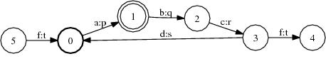
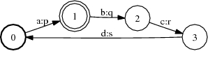

# Connect

## Description

This operation [trims](glossary.md#trim) an FST, removing states and arcs that
are not on [successful paths](glossary.md#successful-path).

## Usage

```cpp
template<class Arc>
void Connect(MutableFst<Arc> *fst);
```

```bash
fstconnect a.fst out.fst
```

## Examples

### A:



### Connect of A:



```bash
Connect(&A);
fstconnect a.fst out.fst
```

## Complexity

`Connect`:

*   Time: $O(V + E)$
*   Space: $O(V + E)$

where $V$ = # of states and $E$ = # of arcs.
