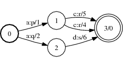
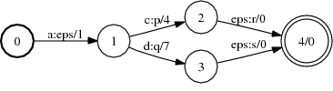

# Determinize

## Description

This operation determinizes a weighted transducer. The result will be an
[equivalent](glossary.md#equivalent) FST that has the property that no state has
two transitions with the same input label. For this algorithm,
[epsilon](glossary.md#epsilon) transitions are treated as regular symbols (cf.
[RmEpsilon](rm_epsilon.md)).

The transducer must be [functional](glossary.md#functional). The weights must be
(weakly) [left divisible](weight_requirements.md) (valid for TropicalWeight and
LogWeight for instance) and [zero-sum-free](glossary.md#zero-sum-free).

## Usage

```cpp
template <class Arc>
void Determinize(const Fst<Arc> &ifst, MutableFst<Arc> *ofst);
```

```cpp
template <class Arc> DeterminizeFst<Arc>::
DeterminizeFst(const Fst<Arc> &fst);
```

[`DeterminizeFst`](https://www.openfst.org/doxygen/fst/html/classfst_1_1DeterminizeFst.html)

```bash
fstdeterminize a.fst out.fst
```

## Examples

### A:



(TropicalWeight)

### Determinize of A:



```bash
Determinize(&A);
DeterminizeFst<Arc>(A);
fstdeterminize a.fst out.fst
```

## Complexity

`Determinize`:

*   Determinizable: *exponential (polynomial in the size of the output)*
*   Non-determinizable: *does not terminate*

`DeterminizeFst:`

*   Determinizable: *exponential (polynomial in the size of the output)*
*   Non-determinizable: *does not terminate*

The determinizable automata include all unweighted and all acyclic input.

## Caveats

Epsilons may be added as input labels at the ends of paths when determinizing
transducers. If input transducer also contains epsilons, this may result in a
non-deterministic result even when the epsilons are treated as regular symbols.
The *subsequential label* can be chosen as a non-zero value to avoid this issue
by passing it as an option

Non-functional transducers are handled by choosing he determinize type option
(in a variant call to this function/class):

*   FUNCTIONAL: give an error for non-functional input (default)
*   NONFUNCTIONAL: permissible when the output ambiguity is finite
    (*$p$-subsequentiable*). The `subsequential_label` should be non-zero and
    `increment_subsequential_label` should be true or the result can be
    non-deterministic by the default use of epsilons as the $p$-subsequential
    labels found at the ends of paths. Care should be taken that these
    $p$-subsequential labels ($\mathtt{subsequential\_label}, \dots,
    \mathtt{subsequential\_label} - p - 1$) do not collide with existing
    labels.
*   DISAMBIGUATE: only the shortest path output for each input is retained,
    permissible when the semiring has the
    [path property](weight_requirements.md)

## See Also

[Disambiguate](disambiguate.md), [RmEpsilon](rm_epsilon.md)

## References

*   Mehryar Mohri.
    [Finite-State Transducers in Language and Speech Processing.](http://www.cs.nyu.edu/~mohri/postscript/cl1.pdf)
    *Computational Linguistics*, 23:2, 1997.
*   Cyril Allauzen and Mehryar Mohri.
    [Efficient Algorithms for Testing the Twins Property.](http://cs.nyu.edu/~allauzen/pdf/twins.pdf)
    *Journal of Automata, Languages and Combinatorics*, 8(2):117-144, 2003.
