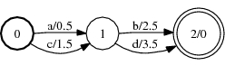
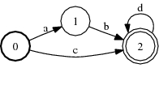
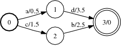

# Difference

## Description

This operation computes the difference between two FSAs. Only strings that are
in the first automaton but not in second are retained in the result.

The first argument must be an [acceptor](glossary.md#acceptor); the second
argument must be an unweighted, [epsilon-free](glossary.md#epsilon),
[deterministic](glossary.md#deterministic) acceptor. The output labels of the
first acceptor or the input labels of the second acceptor must be
[sorted](arc_sort.md) (or the FSTs otherwise support appropriate
[matchers](quick_tour.md#matcher)).

## Usage

```cpp
template <class Arc>
void Difference(const Fst<Arc> &ifsa1, const Fst<Arc> &ifsa2, MutableFst<Arc> *ofsa);
```

```cpp
template <class Arc> DifferenceFst<Arc>::
DifferenceFst(const Fst<Arc> &fsa1, const Fst<Arc> &fsa2);
```

[`DifferenceFst`](https://www.openfst.org/doxygen/fst/html/classfst_1_1DifferenceFst.html)

```bash
fstdifference [--opts] a.fsa b.fsa out.fsa
  --connect: Trim output (def: true)
```

## Examples

### A:



### B:



### A - B:



```bash
Difference(A, B, &C);
DifferenceFst<Arc>(A, B);
fstdifference a.fsa b.fsa out.fsa
```

## Complexity

Same as *[Compose](compose.md#complexity)*.

## Caveats

Same as *[Compose](compose.md#caveats)*.
