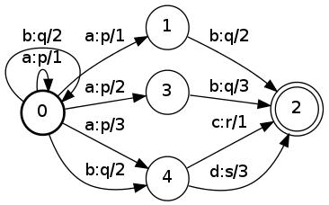
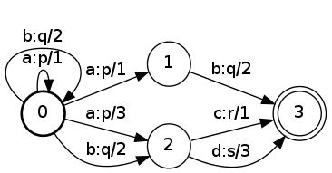
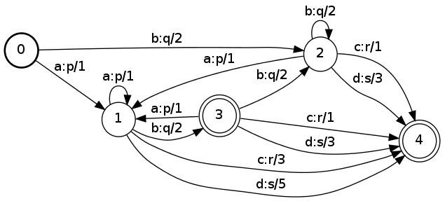

# Disambiguate

## Description

This operation disambiguates a weighted transducer. The result will be an
[equivalent](glossary.md#equivalent) FST that has the property that no two
successful paths have the same input labeling. For this algorithm,
[epsilon](glossary.md#epsilon) transitions are treated as regular symbols (cf.
[RmEpsilon](rm_epsilon.md)).

The transducer must be [functional](glossary.md#functional). The weights must be
(weakly) [left divisible](weight_requirements.md) (valid for TropicalWeight and
LogWeight for instance) and [zero-sum-free](glossary.md#zero-sum-free).

## Usage

```cpp
template <class Arc>
void Disambiguate(const Fst<Arc> &ifst, MutableFst<Arc> *ofst);
```

## Examples

### A:



(TropicalWeight)

### Disambiguate of A:



```bash
Disambiguate(A, &out);
fstdisambiguate a.fst out.fst
```

### Determinize of A:



(For comparison since [deterministic](glossary.md#deterministic) implies
[unambiguous](glossary.md#unambiguous).)

## Complexity

`Disambiguate`:

*   Disambiguate: *exponential (polynomial in the size of the output)*
*   Non-disambiguable: *does not terminate*

The disambiguable automata include all unweighted, all acyclic and all
determinizable input. There are disambiguable automata that are not
determinizable.

## See Also

[Determinize](determinize.md), [RmEpsilon](rm_epsilon.md)

## References

*   Mehryar Mohri and Michael Riley,
    [On the Disambiguation of Weighted Automata](http://arxiv.org/abs/1405.0500),
    *ArXiv e-prints*, cs-FL/1405.0500, 2014.
