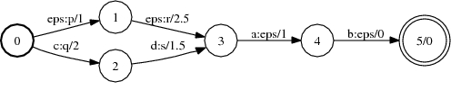
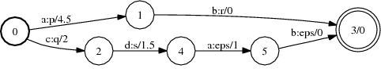

# EpsNormalize

## Description

Returns an [equivalent](glossary.md#equivalent) FST that is epsilon-normalized.
An acceptor is epsilon-normalized if it is [epsilon-removed](rm_epsilon.md). A
transducer is input epsilon-normalized if additionally if on each path any
epsilon input label follows all non-epsilon input labels. Output
epsilon-normalized is defined similarly.

The input FST needs to be [functional](glossary.md#functional).

## Usage

```txt
enum EpsNormalizeType { EPS_NORM_INPUT, EPS_NORM_OUTPUT };
```

```cpp
template<class Arc>
void EpsNormalize(const Fst<Arc> &ifst, MutableFst<Arc> *ofst, EpsNormalizeType type);
```

```bash
fstepsnormalize [--opts] a.fst out.fst
 --eps_norm_output: Normalize output epsilons (def: false)
```

## Examples

### A:



### (Input) Epsilon Normalize of A:



```bash
Epsnormalize(A, &B, EPS_NORM_INPUT);
fstepsnormalize a.fst out.fst
```

## Complexity

TBA

## References

*   Mehryar Mohri. [Generic epsilon-removal and input epsilon-normalization
    algorithms for weighted
    transducers](http://www.cs.nyu.edu/~mohri/postscript/ijfcs.ps),
    *International Journal of Computer Science*, 13(1): 129-143, 2002.
