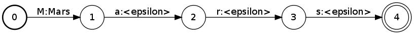
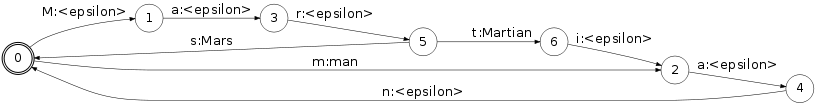
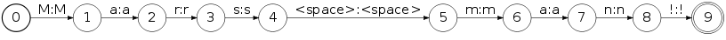
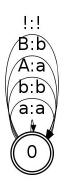
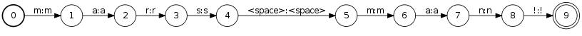
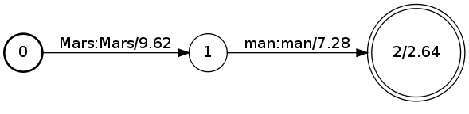
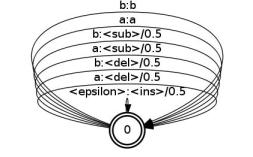
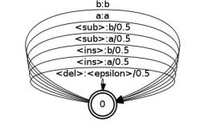

# OpenFst Examples

Reading the [quick tour](quick_tour.md) first is recommended. That includes a
simple [example](quick_tour.md#example-use-fst-application) of FST application
using either the C++ template level or the shell-level operations. The
[advanced usage](advanced_usage.md) topic contains an
[implementation](advanced_usage.md#example) using the template-free intermediate
[scripting level](advanced_usage.md#fstscript) as well.

The following data files are used in the examples below:

File                                              | Description                                                                             | Source
------------------------------------------------- | --------------------------------------------------------------------------------------- | ------
[wotw.txt](examples/public_domain/wotw/wotw.txt)        | (normalized) text of *The War of the Worlds* by H. G. Wells                             | [Project Gutenberg](https://www.gutenberg.org/cache/epub/36/pg36.txt)
[wotw.lm.gz](examples/wotw.lm.gz)                 | 5-gram language model for `wotw.txt` in [OpenFst text format](quick_tour.md#fstcompile) | [www.opengrm.org](http://www.opengrm.org)
[wotw.syms](examples/wotw.syms)                   | FST symbol table file for `wotw.lm`                                                     | [www.opengrm.org](http://www.opengrm.org)
[ascii.syms](examples/ascii.syms)                 | FST symbol table file for ASCII letters                                                 | [Python](https://www.python.org): `for i in range(33,127): print "%c %d\n" % (i,i)`
[lexicon.txt.gz](examples/lexicon.txt.gz)         | letter-to-token FST for `wotw.syms`                                                     | see first example below
[lexicon_opt.txt.gz](examples/lexicon_opt.txt.gz) | optimized letter-to-token FST for `wotw.syms`                                           | see first example below
[downcase.txt](examples/full_downcase.txt)        | ASCII letter-to-downcased letter FST                                                    | `awk 'NR>1 { print 0,0,$1,tolower($1) } ; END { print 0 }' <ascii.syms >downcase.txt`

With these files and the descriptions below, the reader should be able to repeat
the examples. With about 340,000 words in *The War of the Worlds*, it is a small
corpus that allows non-trivial examples.

A few general comments about the examples:

1.  For the most part, we illustrate with the shell-level commands for
    convenience.
2.  The [fstcompose](compose.md) operation is used often here. Typically, one or
    both of the input FSTs should be appropriately [sorted](arc_sort.md) before
    composition. In the examples below, however, we have only illustrated
    sorting where it is necessary, to keep the presentation shorter. The
    provided data files are pre-sorted for their intended use. (See Exercise 4
    for more details.)
3.  Files with a .fst extension should be produced from their
    [text description](quick_tour.md#fstcompile) by a call to fstcompile. This
    is illustrated at the beginning, but is often implicit throughout the rest
    of this document.

## Tokenization

The first example converts a sequence of ASCII characters into a sequence of
word tokens with punctuation and whitespace stripped. To do so we will need a
*lexicon* transducer that maps from letters to their corresponding word tokens.
A simple way to generate this is using the
[OpenFst text format](quick_tour.md#fstcompile). For example, the word *Mars*
would have the form:

```bash
$ fstcompile --isymbols=ascii.syms --osymbols=wotw.syms >Mars.fst <<EOF
0 1 M Mars
1 2 a <epsilon>
2 3 r <epsilon>
3 4 s <epsilon>
4
EOF
```

This can be drawn with:

```bash
$ fstdraw --isymbols=ascii.syms --osymbols=wotw.syms -portrait Mars.fst | dot -Tjpg >Mars.jpg
```

which produces:



Suppose that `Martian.fst` and `man.fst` have similarly been created, then:

```bash
$ fstunion man.fst Mars.fst | fstunion - Martian.fst | fstclosure >lexicon.fst
```

produces a finite-state lexicon that transduces zero or more spelled-out word
sequences into their word tokens:


The non-determinism and non-minimality introduced by the construction can be
removed with:

```bash
$ fstrmepsilon lexicon.fst | fstdeterminize | fstminimize >lexicon_opt.fst
```

resulting in the equvialent, deterministic and minimal:



In order to handle punctuation symbols, we change the lexicon construction to:

```bash
$ fstunion man.fst Mars.fst | fstunion - Martian.fst | fstconcat - punct.fst | fstclosure >lexicon.fst
```

where:

```bash
$ fstcompile --isymbols=ascii.syms --osymbols=wotw.syms >punct.fst <<EOF
0 1 <space> <epsilon>
0 1 . <epsilon>
0 1 , <epsilon>
0 1 ? <epsilon>
0 1 ! <epsilon>
1
EOF
```

is a transducer that deletes common punctuation symbols. The full punctuation
transducer is [here](examples/full_punct.txt).

Now, the tokenizaton of the example string *Mars man* encoded as an FST:



can be done with:

```bash
$ fstcompose Marsman.fst lexicon_opt.fst | fstproject --project_output | fstrmepsilon >tokens.fst
```

giving:


Note that our construction of `lexicon.fst` requires that all tokens be
separated by *exactly* one whitespace character, including at the end of the
string (hence the '!' in the previous example).

To generate a full lexicon of all 7102 distinct words in the *War of Worlds*, it
is convenient to dispense with the union of individual word FSTs above and
instead generate a single text FST from the word symbols in `wotw.syms`.
[Here](examples/makelex.py.txt) is a python script that does that and was used,
along with the above steps, to generate the
[full optimized lexicon](examples/lexicon_opt.txt.gz) (which you should compile
to `lexicon_opt.fst`).

#### Exercise 1

The above tokenization does not handle numeric character input.

1.  Create a transducer that maps numbers in the range 0 - 999999 represented as
    digit strings to their English read form, e.g.:

```txt
1 -> one
11 -> eleven
111 -> one hundred eleven
1111 -> one thousand one hundred eleven
11111 -> eleven thousand one hundred eleven
```

1.  Incorporate this transduction into the letter-to-token transduction above
    and apply to the input *Mars is 4225 miles across.* represented as letters.

## Downcasing Text

The next example converts case-sensitive input to all lowercase output. To do
the conversion, we create a *flower* transducer of the form:

```bash
$ fstcompile --isymbols=ascii.syms --osymbols=ascii.syms >downcase.fst <<EOF
0 0 ! !
0 0 A a
0 0 B b
0 0 a a
0 0 b b
0
EOF
```

which produces:



A downcasing flower transducer for the full character set is
[here](examples/full_downcase.txt). This transducer can be applied to the *Mars
men* automaton from the previous example with:

```bash
$ fstproject Marsman.fst | fstcompose - full_downcase.fst | fstproject --project_output >marsman.fst
```

giving:



Why use transducers for this when UNIX commands like `tr` and C library routines
like `tolower` are some of the many easy ways to downcase text? Transducers have
several advantages over these approaches. First, more complex transformations
are almost as easy to write (see Example 2). Second, trying to invert this
transduction is less trivial and can be quite useful (see the next section).
Finally, this transducer operates on any finite-state input not just a string.
For example,

```bash
$ fstinvert lexicon_opt.fst | fstcompose - full_downcase.fst | fstinvert >lexicon_opt_downcase.fst
```

downcases the letters in the lexicon from the previous example.

A transducer that downcases at the token level (but see Exercise 3a) can be
created with:

```bash
$ fstinvert lexicon_opt.fst | fstcompose - full_downcase.fst | fstcompose - lexicon_opt.fst |
  fstrmepsilon | fstdeterminize | fstminimize  >downcase_token.fst
```

#### Exercise 2

Create a transducer that:

1.  upcases letters that are string-initial or after a punctuation symbol/space
    (*capitalization transducer*).

2.  converts lowercase underscore-separated identifiers such as
    `num_final_states` to the form `NumFinalStates` (*CamelCase transducer*).

#### Exercise 3

1.  The letter-level downcasing transducer downcases any ASCII input. For which
    inputs does the token-level downcasing transducer work? What changes would
    be necessary to cover all inputs from `wotw.syms`?

2.  If a token *The* were applied to `downcase_token.fst`, what would the output
    look like? What would it look like if the optimizations (epsilon-removal,
    determinization and minimization) were omitted from the construction of
    `downcase_token.fst`.

#### Exercise 4

Create a 1,000,000 ASCII character string represented as an FST. Compose it on
the left with `downcase.fst` and time the computation. Compose it on the right
and time the computation. The labels in `downcase.fst` were pre-sorted on one
side; use `fstinfo` to determine which side. Use `fstarcsort` to sort
`downcase.fst` on the opposite side and repeat the experiments above. Given that
[composition](compose.md) matching uses binary search on the sorted side (with
the higher out-degree, if both sides are sorted), explain the differences in
computation time that you observe.

## Case Restoration in Text

This example creates a transducer that attempts to restore the case of downcased
input. This is the first non-trivial example and, in general, there is no
error-free way to do this. The approach taken here will be to use case
statistics gathered from the *The War of the Worlds* source text to help solve
this. In particular, we will use an [n-gram language model](examples/wotw.lm.gz)
created on this text that is represented as a finite-state automaton in
`OpenFst` format, which you should compile to the file `wotw.lm.fst`. Here is a
typical path in this 5-gram automaton:

```bash
$ fstrandgen --select=log_prob wotw.lm.fst | fstprint  --isymbols=wotw.syms  --osymbols=wotw.syms
0   1   The   The
1   2   desolating   desolating
2   3   cry   cry
3   4   <epsilon>   <epsilon>
4   5   worked   worked
5   6   <epsilon>   <epsilon>
6   7   upon   upon
7   8   my   my
8   9   mind   mind
9   10   <epsilon>   <epsilon>
10   11   once   once
11   12   <epsilon>   <epsilon>
12   13   <epsilon>   <epsilon>
13   14   I   I
14   15   <epsilon>   <epsilon>
15   16   <epsilon>   <epsilon>
16   17   slept   slept
17   18   <epsilon>   <epsilon>
18   19   little   little
19
```

This model is constructed to have a transition for every 1-gram to 5-gram seen
in 'War of the Worlds' with its weight related to the (negative log) probability
of that n-gram occurring in the text corpus. The epsilon transitions correspond
to backoff transitions in the smoothing of the model that was performed to allow
accepting input sequences not seen in training.

Given this language model and using the lexicon and downcasing transducers from
the previous examples, a solution is:

```bash
# Before trying this, read the whole section.
$ fstcompose lexicon_opt.fst wotw.lm.fst | fstarcsort --sort_type=ilabel >wotw.fst
$ fstinvert full_downcase.fst | fstcompose - wotw.fst >case_restore.fst
```

The first FST, `wotw.fst`, maps from letters to tokens following the probability
distribution of the language model. The second FST, `case_restore.fst` is
similar but uses only downcased letters. Case prediction can then be performed
with:

```bash
$ fstcompose marsman.fst case_restore.fst | fstshortestpath |
  fstproject --project_output | fstrmepsilon | fsttopsort >prediction.fst
```

which gives:



In other words, the most likely case of the input is determinized with respect
to the n-gram model.

There is a serious problem, however, with the above solution. For all but tiny
corpora, the first composition is extremely expensive with the classical
[composition](compose.md) algorithm since the output labels in `lexicon_opt.fst`
have been pushed back when it was determinized and this greatly delays matching
with the labels in `wotw.lm.fst`. There are three possible solutions:

First, we can use the input to restrict the composition chain as:

```bash
$ fstcompose full_downcase.fst marsman.fst | fstinvert | fstcompose - lexicon_opt.fst |
  fstcompose - wotw.lm.fst | fstshortestpath | fstproject -project_output | fstrmepsilon | fsttopsort >prediction.fst
```

This works fine but has the disadvantage that we don't have a single transducer
to apply and we are depending on the input being a string or otherwise small. A
second solution, which gives a single optimized transducer, is to replace
transducer determinization and minimization of
[lexicon.fst](examples/lexicon.txt.gz) with automata determinization and
minimization (via [encoding](encode_decode.md) the input and output label pairs
into a single new label) followed by the transducer determinization and
minimization of the result of the composition with `wotw.fst`:

```bash
$ fstencode --encode_labels lexicon.fst enc.dat | fstdeterminize | fstminimize |
  fstencode --decode - enc.dat >lexicon_compact.fst
$ fstcompose lexicon_compact.fst wotw.lm.fst | fstdeterminize | fstminimize | fstarcsort --sort_type=ilabel >wotw.fst
$ fstinvert full_downcase.fst | fstcompose - wotw.fst >case_restore.fst
```

This solution is a natural and simple one but has the disadvantage that the
transducer determinization and minimization steps are quite expensive. A better
solution is to use an FST representation that allows
[lookahead matching](advanced_usage.md#look-ahead-matchers), which composition
can exploit to avoid the matching delays:

```bash
# Converts to a lookahead lexicon
$ fstconvert --fst_type=olabel_lookahead --save_relabel_opairs=relabel.pairs lexicon_opt.fst >lexicon_lookahead.fst
$ fstrelabel --relabel_ipairs=relabel.pairs wotw.lm.fst | fstarcsort --sort_type=ilabel >wotw_relabel.lm
# Relabels the language model input (required by lookahead implementation)
$ fstcompose lexicon_lookahead.fst wotw_relabel.lm >wotw.fst
$ fstinvert full_downcase.fst | fstcompose - wotw.fst >case_restore.fst
```

The relabeling of the input labels of the language model is a by-product of how
the lookahead matching works. Note in order to use the lookahead FST formats you
must use `--enable-lookahead-fsts` in the library configuration and you must set
your `LD_LIBRARY_PATH` (or equivalent)
[appropriately](advanced_usage.md#fst-types).

#### Exercise 5

1.  Find the weight of the *second* shortest *distinct* token sequence in the
    prediction example above.

2.  Find the weight of the *second* shortest *distinct* token sequence in the
    prediction example above *without* using the `--nshortest` flag (hint: use
    [fstdifference](difference.md)).

3.  Find all paths within weight 10 of the shortest path in prediction example.

#### Exercise 6

1.  The case restoration above can only work for words that are found in the
    [text corpus](examples/wotw.txt). Describe an alternative that gives a
    plausible result on any letter sequence.

2.  Punctuation can give clues to the case of nearby words (e.g. *i was in
    cambridge, ma. before. it was nice.*). Describe a method to exploit this
    information in case restoration.

#### Exercise 7

Create a transducer that converts the digits 0-9 into their possible telephone
keypad alphabetic equivalents (e.g., 2: a,b,c; 3: d,e,f) and allows for spaces
as well. Use this transducer to convert the sentence *no one would have believed
in the last years of the nineteenth century that this world was being watched
keenly and closely* into digits and spaces. Use the lexicon alone to
disambiguate this digit and space sequence (cf. *T9* phone input). Now use both
the lexicon and the language model to disambiguate it.

## Edit Distance

Since the predictions made in the previous example might not always be correct,
we may want to measure the error when we have the correct *reference* answers as
well. One common error measure is computed by aligning the hypothesis and
reference, defining:

```txt
edit distance =  # of substitutions + # of deletions + # of insertions
```

and then defining

```txt
error rate  =  edit distance / # of reference symbols
```

If this is computed on letters, it is called the *letter error rate*; on words,
it is called the *word error rate*.

Suppose the reference and (unweighted) hypothesis are represented as
finite-state automata `ref.fst` and `hyp.fst` respectively. Then:

```bash
$ fstcompose ref.fst  edit.fst | fstcompose - hyp.fst |
# Returns shortest distance from final states to the initial (first) state
$ fstshortestdistance --reverse | head -1
```

computes the edit distance between the reference and hypothesis according to the
edit transducer `edit.fst`. The edit transducer for two letters `a` and `b` is
the flower automaton:


This counts any substitution (`a:b`, `b:a`), insertion (`<epsilon>:a`,
`<epsilon>:b`), or deletion as (`a:<epsilon>:a`, `b:<epsilon>`) as 1 edit and
matches (`a:a`, `b:b`) as zero edits. For word error rate, we use the
*Levenshtein* edit distance, i.e. where the cost of substitutions, insertions,
and deletions are all the same. However, each pairing of a symbol (or epsilon)
with another symbol can be given a separate cost in a more general edit
distance. This can obviously be implemented by choosing different weights for
the corresponding edit transducer transitions. Even more general edit distances
can be defined (see Exercise 8).

Note that if the hypothesis is not a string but a more general automaton
representing a set of hypotheses (e.g. the result from Exercise 5c) then this
procedure returns the *oracle edit distance*, i.e., the edit distance of the
best-matching ('oracle-provided') hypothesis compared to the reference. The
corresponding *oracle error rate* is a measure of the quality of the hypothesis
set (often called a 'lattice').

There is one serious problem with this approach and that is when the symbol set
is large. For the 95 letter `ascii.syms`, the Levenstein edit transducer will
have 9215 transitions. For the 7101 word `wotw.syms`, there would need to be
50,438,403 transitions. While this is still manageable, larger vocabularies of
100,000 and more words are unwieldy.

For the Levenstein distance, there is a simple solution: factor the edit
transducer into two components. Using the example above, the left factor,
`edit1.fst`, is:



and the right factor, `edit2.fst`, is:



These transducers include new symbols `<sub>`, `<del>`, and `<ins>` that are
used for the substitution, deletion and insertion of other symbols respectively.
In fact, the composition of these two transducers is equivalent to the original
edit transducer `edit.fst`. However, each of these transducers has $4 |V|$
transitions where $|V|$ is the number of distinct symbols, whereas the
original edit transducer has $(|V|+1)^2-1$ transitions.

Given these factors, compute:

```bash
$ fstcompose ref.fst edit1.fst | fstarcsort >ref_edit.fst
$ fstcompose edit2.fst hyp.fst | fstarcsort >hyp_edit.fst
$ fstcompose ref_edit.fst hyp_edit.fst | fstshortestdistance --reverse | head -1
```

With large inputs, the shortest distance algorithm may need to use inadmissable
[pruning](advanced_usage.md#state-queues). This is because the edit transducer
allows arbitrary insertions and deletions, so the search space is quadratic in
the length of the input. Alternatively the edit transducer could be changed (see
Exercise 8b).

With more general edit transducers, this factoring may not be possible. In that
case, representing the edit transducer in some specialized compact FST
representation would be possible but pairwise compositions might be very
expensive. A three-way composition algorithm or specialized composition
[matchers](advanced_usage.md#matchers) and
[filters](advanced_usage.md#composition-filters) are approaches that could
implement this more efficiently.

As an example, we can see to what extent the case restoration transducer errs on
a given input by computing the edit distance between the output it yields and
the reference answer. We will use the Levenshtein distance.

First, generate `edit1.fst` and `edit2.fst`. These should be structured like the
example above, but should provide transitions for each symbol of `ascii.symb`
not just 'a' and 'b'. You will need to create `levenshtein.symb` which contains
the definitions of `ascii.symb` plus new definitions for `<ins>`, `<del>` and
`<sub>`. Then, prepare the transducers `edit1.txt` and `edit2.txt` as above from
`ascii.symb`, and compile them (`edit1.fst` would have `ascii.symb` as input
symbols and `levenshtein.symb` as output symbols, and `edit2.fst` would have the
input and output symbols swapped).

Create a transducer `ref.fst` representing a correctly capitalized English
sentence using words from the corpus and with adequate whitespace. You might
want to use words which appear both capitalized and uncapitalized in the source
text to have a chance to observe a non-zero edit distance. A suitable
(nonsensical) example is the following: "The nice chief astronomer says that
both the terraces of the south tower and the western mills in the East use the
English Channel as a supply pool "

You can now downcase `ref.fst` (with the `full_downcase.fst` transducer
presented above), apply `case_restore.fst` to it and get the hypothesis output
for this input (as was explained in the section about case restoration). Compose
that with the reversed tokenizer to get the hypothesis represented as a sequence
of characters not tokens. This is `hyp.fst`, which should be a FST representing
a string along the lines of "The Nice chief Astronomer says that both the
terraces of the south Tower and the western Mills in the east use the English
channel as a Supply Pool ".

Now, you can compute the edit distance as in the example above. For the given
`ref.fst` and `hyp.fst`, the edit distance should be 8. You can also show the
alignment (which, in the present case, will only include substitutions):

```bash
$ fstcompose ref.fst edit1.fst | fstarcsort >ref_edit.fst
$ fstcompose edit2.fst hyp.fst | fstarcsort >hyp_edit.fst
$ fstcompose ref_edit.fst hyp_edit.fst | fstshortestpath | fstrmepsilon | fsttopsort |
  fstprint --isymbols=levenshtein.syms  --osymbols=levenshtein.syms
```

Here is the output (with some added color to make it easier to read):

```txt
0   1   T   T
1   2   h   h
2   3   e   e
3   4   <space> <space>
4   5   n   N   1
5   6   i   i
6   7   c   c
7   8   e   e
8   9   <space> <space>
9   10  c   c
10  11  h   h
11  12  i   i
12  13  e   e
13  14  f   f
14  15  <space> <space>
15  16  a   A   1
16  17  s   s
17  18  t   t
18  19  r   r
19  20  o   o
20  21  n   n
21  22  o   o
22  23  m   m
23  24  e   e
24  25  r   r
25  26  <space> <space>
26  27  s   s
27  28  a   a
28  29  y   y
29  30  s   s
30  31  <space> <space>
31  32  t   t
32  33  h   h
33  34  a   a
34  35  t   t
35  36  <space> <space>
36  37  b   b
37  38  o   o
38  39  t   t
39  40  h   h
40  41  <space> <space>
41  42  t   t
42  43  h   h
43  44  e   e
44  45  <space> <space>
45  46  t   t
46  47  e   e
47  48  r   r
48  49  r   r
49  50  a   a
50  51  c   c
51  52  e   e
52  53  s   s
53  54  <space> <space>
54  55  o   o
55  56  f   f
56  57  <space> <space>
57  58  t   t
58  59  h   h
59  60  e   e
60  61  <space> <space>
61  62  s   s
62  63  o   o
63  64  u   u
64  65  t   t
65  66  h   h
66  67  <space> <space>
67  68  t   T   1
68  69  o   o
69  70  w   w
70  71  e   e
71  72  r   r
72  73  <space> <space>
73  74  a   a
74  75  n   n
75  76  d   d
76  77  <space> <space>
77  78  t   t
78  79  h   h
79  80  e   e
80  81  <space> <space>
81  82  w   w
82  83  e   e
83  84  s   s
84  85  t   t
85  86  e   e
86  87  r   r
87  88  n   n
88  89  <space> <space>
89  90  m   M   1
90  91  i   i
91  92  l   l
92  93  l   l
93  94  s   s
94  95  <space> <space>
95  96  i   i
96  97  n   n
97  98  <space> <space>
98  99  t   t
99  100 h   h
100 101 e   e
101 102 <space> <space>
102 103 E   e   1
103 104 a   a
104 105 s   s
105 106 t   t
106 107 <space> <space>
107 108 u   u
108 109 s   s
109 110 e   e
110 111 <space> <space>
111 112 t   t
112 113 h   h
113 114 e   e
114 115 <space> <space>
115 116 E   E
116 117 n   n
117 118 g   g
118 119 l   l
119 120 i   i
120 121 s   s
121 122 h   h
122 123 <space> <space>
123 124 C   c   1
124 125 h   h
125 126 a   a
126 127 n   n
127 128 n   n
128 129 e   e
129 130 l   l
130 131 <space> <space>
131 132 a   a
132 133 s   s
133 134 <space> <space>
134 135 a   a
135 136 <space> <space>
136 137 s   S   1
137 138 u   u
138 139 p   p
139 140 p   p
140 141 l   l
141 142 y   y
142 143 <space> <space>
143 144 p   P   1
144 145 o   o
145 146 o   o
146 147 l   l
147 148 <space> <space>
148
```

#### Exercise 8

Create an edit transducer that:

1.  allows only a fixed number N of contiguous insertions or deletions.
2.  computes the Levenshtein distance between American and English spellings of
    words except that
    [common spelling variants](https://en.wikipedia.org/wiki/American_and_British_English_spelling_differences)
    like `-or` vs `-our` or `-ction` vs `-xion` are given lower cost.

#### Exercise 9

Provide a way to:

1.  compute the error rate rather than the edit distance using transducers.
2.  compute the oracle error path as well as the oracle rate for a lattice.
