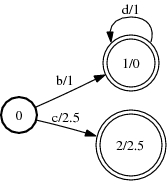
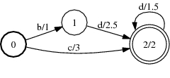
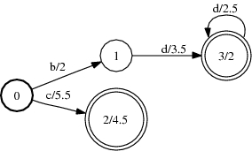

# Intersect

## Description

This operation computes the intersection (Hadamard product) of two FSAs. Only
strings that are in both automata are retained in the result.

The two arguments must be [acceptors](glossary.md#acceptor). One of the
arguments must be [label-sorted](arc_sort.md) (or otherwise support an
appropriate [matcher](quick_tour.md#matcher)).The weights need to form a
[commutative semiring](weight_requirements.md) (valid for `TropicalWeight` and
`LogWeight` for instance).

Versions of this operation (not all shown here) accept
[options](advanced_usage.md#operation-options) that allow choosing the
[matcher](advanced_usage.md#matchers),
[composition filter](advanced_usage.md#composition-filters),
[state table](advanced_usage.md#state-tables) and, when delayed, the
[caching behaviour](advanced_usage.md#caching) used by intersection.

## Usage

```cpp
template <class Arc>
void Intersect(const Fst<Arc> &ifsa1, const Fst<Arc> &ifsa2, MutableFst<Arc> *ofsa);
```

```cpp
template <class Arc> IntersectFst<Arc>::
IntersectFst(const Fst<Arc> &fsa1, const Fst<Arc> &fsa2);
```

[`IntersectFst`](https://www.openfst.org/doxygen/fst/html/classfst_1_1IntersectFst.html)

```bash
fstintersect [--opts] a.fsa b.fsa out.fsa
  --connect: Trim output (def: true)
```

## Examples

### A:



### B:



### A ∩ B:



```bash
Intersect(A, B, &C);
IntersectFst<Arc>(A, B);
fstintersect a.fsa b.fsa out.fsa
```

## Complexity

Same as *[Compose](compose.md#complexity)*.

## Caveats

Same as *[Compose](compose.md#caveats)*.

## See Also

[Composition Filters](advanced_usage.md#composition-filters),
[Matchers](advanced_usage.md#matchers),
[State Tables](advanced_usage.md#state-tables)
