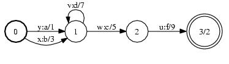

# Invert

## Description

This operation inverts the transduction corresponding to an FST by exchanging
the FST's input and output labels.

## Usage

```cpp
template<class Arc>
void Invert(MutableFst<Arc> *fst);
```

```cpp
template <class Arc> InvertFst<Arc>::
InvertFst(const Fst<Arc> &fst);
```

[`InvertFst`](https://www.openfst.org/doxygen/fst/html/classfst_1_1InvertFst.html)

```bash
fstinvert a.fst out.fst
```

## Examples

### A:


### A-1:



```bash
Invert(&A);
InvertFst<Arc>(A);
fstinvert a.fst out.fst
```

## Complexity

`Invert`:

*   Time: $O(V + E)$
*   Space: $O(1)$

where $V$ = # of states and $E$ = # of arcs.

`InvertFst:`

*   Time:: $O(v + e)$
*   Space: $O(1)$

where $v$ = # of states visited, $e$ = # of arcs visited. Constant time and
space to visit an input state or arc is assumed and exclusive of caching.
