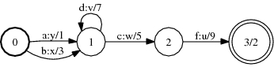
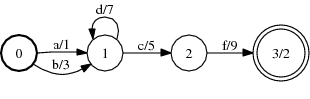
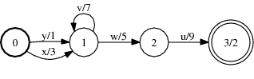

# Project

## Description

This operation projects an FST onto its domain or range by either copying each
arc's input label to its output label or vice versa.

## Usage

```txt
enum ProjectType { PROJECT_INPUT, PROJECT_OUTPUT };
```

```cpp
template<class Arc>
void Project(MutableFst<Arc> *fst, ProjectType type);
```

```cpp
template <class Arc> ProjectFst<Arc>::
ProjectFst(const Fst<Arc> &fst, ProjectType type);
```

[`ProjectFst`](https://www.openfst.org/doxygen/fst/html/classfst_1_1ProjectFst.html)

```bash
fstproject [--opts] a.fst out.fst
  --project_output: Project on output (def false)
```

## Examples

### A:



### π1(A):



```bash
Project(&A, PROJECT_INPUT);
ProjectFst<Arc>(A, PROJECT_INPUT);
fstproject a.fst out.fst
```

### π2(A):



```bash
Project(&A, PROJECT_OUTPUT);
ProjectFst<Arc>(A, PROJECT_OUTPUT);
fstproject --project_output=true a.fst out.fst
```

## Complexity

`Project`:

*   TIme: $O(V + E)$
*   Space: $O(1)$

where $V$ = # of states and $E$ = # of arcs.

`ProjectFst:`

*   Time: $O(v + e)$
*   Space: $O(1)$

where $v$ = # of states visited, $e$ = # of arcs visited Constant time and
to visit an input state or arc is assumed and exclusive of
[caching](advanced_usage.md#caching).
