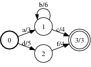
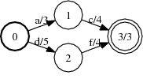

# Prune

## Description

This operation deletes states and arcs in the input FST that do not belong to a
successful path whose weight is no more (w.r.t the natural the natural semiring
order) than the threshold *t* ⊗-times the weight of the shortest path in the
input FST.

Weights need to be commutative and have the path property. Both destructive and
constructive implementations are available.

## Usage

```cpp
template <class Arc>
void Prune(MutableFst<Arc> *fst, typename Arc::Weight threshold);
```

```cpp
template <class Arc>
void Prune(const Fst<Arc> &ifst, MutableFst<Arc> *ofst, typename Arc::Weight threshold);
```

```bash
fstprune [--opts] in.fst out.fst
    --weight: type = string, default = ""
      Weight parameter
```

### A:



### Prune of A with threshold 3:



```bash
Prune(&A, 3);
Prune(A, &B, 3);
fstprune --weight=3 a.fst out.fst
```

## Complexity

`Prune:`

*   Time: $O(V \log V + E)$
*   Space: $O(V + E)$

where $V$ = # of states and $E$ = # of arcs.
