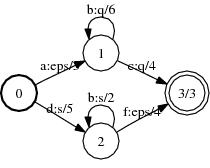
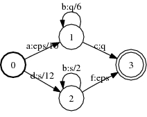
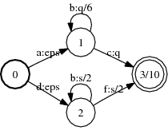

# Push

## Description

This operation produces an equivalent transducer by pushing the weights and/or
the labels towards the initial state or toward the final states.

### Weight pushing

When pushing weights towards the initial state, the sum of the weight of the
outgoing transitions and final weight at any non-initial state is equal to $1$
in the resulting machine. When pushing weights towards the final states, the sum
of the weight of the incoming transitions at any state is equal to $1$.

Weight needs to be left distributive when pushing towards the initial state and
right distributive when pushing towards the final states.

### Label pushing

Pushing labels towards the initial state consists in minimizing at every state
the length of the longest common prefix of the output labels of the outgoing
paths. Pushing labels towards the final states consists in minimizing at every
state the length of the longest common suffix of the output labels of the
incoming paths.

## Usage

```cpp
const uint32 kPushWeights = 0x0001;
const uint32 kPushLabels =  0x0002;

enum ReweightType { REWEIGHT_TO_INITIAL, REWEIGHT_TO_FINAL };

template <class Arc, ReweightType rtype>
void Push(const Fst<Arc> &ifst, MutableFst<Arc> *ofst, uint32 ptype);
```

```bash
fstpush [--opts] a.fst out.fst
    --to_final: type = bool, default = false
      Push/reweight to final (vs. to initial) states
    --push_labels: type = bool, default = false
      Push output labels
    --push_weights: type = bool, default = false
      Push weights
```

## Examples

### A:



### Push weights of A to initial state:



```bash
Push<Arc, REWEIGHT_TO_INITIAL>(A, &B, kPushWeights);
fstpush --push_weights a.fst out.fst
```

### Push labels of A to initial state:


```bash
Push<Arc, REWEIGHT_TO_INITIAL>(A, &B, kPushLabels);
fstpush --push_labels a.fst out.fst
```

### Push weights and labels of A to final states



```bash
Push<Arc, REWEIGHT_TO_FINAL>(A, &B, kPushWeights|kPushLabels);
fstpush --push_weights --push_labels --to_final a.fst out.fst
```

## Complexity

`Push:`

*   **Weight pushing:**

*   Time:

*   Acyclic: $O(V + E)$

*   Tropical semiring: $O(V \log V + E)$

*   General: *exponential*

*   Space: $O(V + E)$

*   **Label pushing:**

*   Time: *polynomial*

*   Space: $O(V^2 + E)$

where $V$ = # of states and $E$ = # of arcs.
