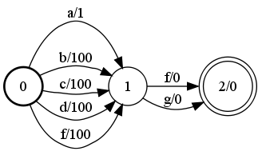
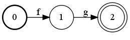
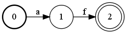

# RandGen

## Description

This operation randomly generates a set of successful paths in the input FST.
The operation relies on an `ArcSelector` object for randomly selecting an
outgoing transition at a given state in the input FST. The default arc selector,
`UniformArcSelector`, randomly selects a transition using the uniform
distribution. `LogProbArcSelector` randomly selects a transition w.r.t. the
weights treated as negative log probabilities after normalizing for the total
weight leaving the state. In all cases, finality is treated as a transition to a
super-final state.

## Usage

```cpp
template <class Arc>
void RandGen(const Fst<Arc> &ifst, MutableFst<Arc> *ofst);
```

```cpp
template <class Arc, class ArcSelector>
void RandGen(const Fst<Arc> &ifst, MutableFst<Arc> *ofst, const RandGenOptions<ArcSelector> &opts);
```

```bash
fstrandgen [--max_length=$l] [--npath=$n] [--seed=$s] [--select=$sel] in.fst out.fst
```

## Example

### A:



### Relabel(A, &B) using UniformArcSelector:



```bash
RandGen(A, &B);
RandGen(A, &B, RandGenOptions<UniformArcSelector<Arc> >(UniformArcSelector<Arc>()));

fstrandgen a.fst b.fst
```

### Relabel(A, &B) using LogProbArcSelector:



```bash
RandGen(A, &B, RandGenOptions<LogProbArcSelector<Arc> >(LogProbArcSelector<Arc>()));

fstrandgen --select=log_prob a.fst b.fst
```

## Complexity:

`RandGen`

*   Time: $O(N \cdot L \cdot cT)$
*   Space: $O(N \cdot L + cS)$

where $N$ = number of paths to be generated, $L$ = expected length of a
successful path according to the considered arc selector, $cT$ = time required
for randomly selecting an arc, and $cS$ = space required for randomly
selecting an arc.
