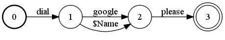
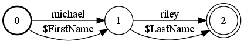
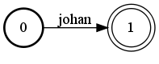
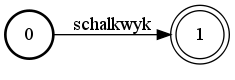
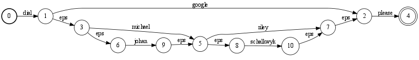

# Replace

## Description

This operation performs the dynamic replacement of arcs in one FST with another
FST, allowing the definition of FSTs analogous to RTNs. It takes as input 1) a
set of pairs formed by a non-terminal label and its corresponding FST, and 2) a
label identifying the root FST in that set. The resulting FST is obtained by
taking the root FST and recursively replacing each arc having a nonterminal as
output label by its corresponding FST.

More precisely, an arc from state `s` to state `d` with output label the
nonterminal `n` is replaced by redirecting this arc to the initial state of a
copy `F` of the FST for nonterminal `n`, replacing its output label by epsilon
(and its input label by epsilon when the option `epsilon_on_replace` is set to
true), and adding epsilon arcs from each final state of `F` to `d`.

## Usage

```cpp
template <class Arc>
void Replace(const vector<pair<typename Arc::Label, const Fst<Arc>* > > &label_fst_pairs,
             MutableFst<Arc> *ofst,
             typename Arc::Label root,
             bool epsilon_on_replace = false);
```

```cpp
template <class Arc> ReplaceFst<Arc>::
ReplaceFst(const vector<pair<typename Arc::Label, const Fst<Arc>* > > &label_fst_pairs,
           typename Arc::Label root);
```

[`ReplaceFst`](https://www.openfst.org/doxygen/fst/html/classfst_1_1ReplaceFst.html)

```cpp
template <class Arc> ReplaceFst<Arc>::
ReplaceFst(const vector<pair<typename Arc::Label, const Fst<Arc>* > > &label_fst_pairs,
           const ReplaceFstOptions<Arc> &opts);
```

```bash
fstreplace [--epsilon_on_replace] root.fst rootlabel [subfst1.fst label1 ....] [out.fst]
```

## Examples

### Symbol table:

`eps`        | `0`
------------ | ----
`$Root`      | `1`
`$Name`      | `2`
`$FirstName` | `3`
`$LastName`  | `4`
`dial`       | `5`
`please`     | `6`
`johan`      | `7`
`schalkwyk`  | `8`
`google`     | `9`
`michael`    | `10`
`riley`      | `11`

### A1:

root FST:



### A2:

FST for nonterminal `$Name` :



### A3:

FST for nonterminal `$FirstName` :



### A4:

Fst for nonterminal `$LastName` :



### B:



```cpp
vector<pair<Label, const Fst<Arc>*> > > label_fst_pairs;
label_fst_pairs.emplace_back(1, A1.Copy());
label_fst_pairs.emplace_back(2, A2.Copy());
label_fst_pairs.emplace_back(3, A3.Copy());
label_fst_pairs.emplace_back(4, A4.Copy());
Replace(label_fst_pairs, &B, 1, true);
```

```txt
ReplaceFst<Arc> B(label_fst_pairs, ReplaceFstOptions<Arc>(1, true));
```

```bash
fstreplace --epsilon_on_replace a1.fst 1 a2.fst 2 a3.fst 3 a4.fst 4 b.fst
```

## Complexity

`Replace`

*   Time: $O(V + E + N)$
*   Space: $O(V + N)$

where $V$ = # of states, $E$ = # of transitions in the **resulting** FST,
and $N$ = # of nonterminals.

`ReplaceFst`

*   Time: $O(v + e + N)$
*   Space: $O(v + N)$

where $v$ = # of visited states, $e$ = # of visited transitions in the
**resulting** FST, and $N$ = # of nonterminals. Constant time and space to
visit an input state or arc is assumed and exclusive of
[caching](advanced_usage.md#caching).

## Caveats

A cyclic dependency among a subset of nonterminals will lead to an infinite
machine. The presence of such cyclic dependencies can be tested in time linear
in the sum of the sizes of the input FSTs using the `CyclicDependencies` method
of the `ReplaceFst` class.
