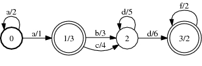
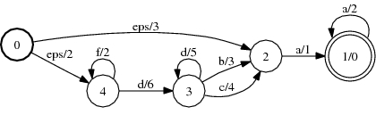

# Reverse

## Description

This operation reverses an FST. If `A` transduces string `x` to `y` with weight
`a`, then the reverse of `A` transduces the reverse of `x` to the reverse of `y`
with weight `a.Reverse()`.

Typically, `a` = `a.Reverse()` and `Arc` = `RevArc` (e.g. for `TropicalWeight`
or `LogWeight`). In general, e.g., when the weights only form a left or right
semiring, the output arc type must match the input arc type except having the
[reversed Weight type](weight_requirements.md).

## Usage

```cpp
template<class Arc, class RevArc>
void Reverse(const Fst<Arc> &ifst, MutableFst<RevArc> *ofst);
```

```bash
fstreverse a.fst out.fst
```

## Examples

### A:



### Reverse of A:



```bash
Reverse(&A);
fstreverse a.fst out.fst
```

## Complexity

`Reverse`:

*   Time: $O(V + E)$
*   Space: $O(V + E)$

where $V$ = # of states and $E$ = # of arcs.
