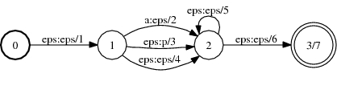
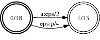

# RmEpsilon

## Description

This operation removes [epsilon](glossary.md#epsilon)-transitions (when both the
input and output label are an epsilon) from a transducer. The result will be an
[equivalent](glossary.md#equivalent) FST that has no such epsilon transitions.

## Usage

```cpp
template <class Arc>
void RmEpsilon(MutableFst<Arc> *fst);
```

```cpp
template <class Arc> RmEpsilonFst<Arc>::
RmEpsilonFst(const Fst<Arc>& fst);
```

[`RmEpsilonFst`](https://www.openfst.org/doxygen/fst/html/classfst_1_1RmEpsilonFst.html)

```bash
fstrmepsilon [--opts] a.fst out.fst
 --connect: Trim output (def: true)
```

## Examples

### A:



(TropicalWeight)

### RmEpsilon of A:



```bash
RmEpsilon(&A);
RmEpsilonFst<Arc>(A);
fstrmepsilon a.fst out.fst
```

## Complexity

`RmEpsilon:`

*   TIme:

*   Unweighted: $O(V^2 + V E)$

*   Acyclic: $O(V^2 + V E)$

*   Tropical semiring: $O(V^2 \log V + V E)$

*   General: *exponential*

*   Space: $O(V E)$

where $V$ = # of states and $E$ = # of arcs.

`RmEpsilonFst:`

*   TIme:

*   Unweighted: $O(v^2 + v e)$

*   General: *exponential*

*   Space: $O(v e)$

where $v$ = # of states visited, $e$ = # of arcs visited. Constant time to
visit an input state or arc is assumed and exclusive of
[caching](advanced_usage.md#caching).

## Caveats

See [here](efficiency.md#algorithm-specific-issues) for a discussion on
efficient usage.

## References

*   Mehryar Mohri. [Generic Epsilon-Removal and Input Epsilon-Normalization
    Algorithms for Weighted
    Transducers](http://www.cs.nyu.edu/~mohri/postscript/ijfcs.ps),
    *International Journal of Computer Science*, 13(1):129-143 (2002).
