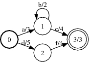

# ShortestDistance

## Description

This operation computes the shortest distance from the initial state to every
state (when `reverse` is `false`) or from every state to the final states (when
`reverse` is `true`). The *shortest distance* from $p$ to $q$ is the
$\oplus$-sum of the weights of all the paths between $p$ and $q$.

The weights must be right (left) distributive if `reverse` is `false` (`true`)
and $k$-closed (i.e., $1 \oplus x \oplus x^2 \oplus \dots \oplus x^{k+1} = 1
\oplus x \oplus x^2 \oplus \dots \oplus x^k$) (valid for non-negative
`TropicalWeight`) or $k$-closed when restricted to the automaton (valid for
`TropicalWeight` with no negative weight cycles).

## Usage

```cpp
template<class Arc>
void ShortestDistance(const Fst<Arc> &fst, vector<typename Arc::Weight> *distance, bool reverse = false);
```

```bash
fstshortestdistance [--opts] a.fst [distance.txt]
    --reverse: type = bool, default = false
      Perform in the reverse direction
```

## Examples

### A, over the tropical semiring:



(TropicalWeight)

### Shortest distance from the initial state

State | Distance
----- | --------
`0`   | `0`
`1`   | `3`
`2`   | `5`
`3`   | `7`

```bash
ShortestDistance(A, &distance);
fstshortestdistance a.fst
```

### Shortest distance to the final states

State | Distance
----- | --------
`0`   | `10`
`1`   | `7`
`2`   | `7`
`3`   | `3`

```bash
ShortestDistance(A, &distance, true);
fstshortestdistance --reverse A.fst
```

## Complexity

`ShortestDistance:`

*   Time:

*   Acyclic: $O(V + E)$

*   Cyclic:

*   Tropical semiring: $O(V \log V + E)$

*   General: exponential

*   Space: $O(V)$

where $V$ = # of states and $E$ = # of arcs.

## Caveats

See [here](efficiency.md#algorithm-specific-issues) for a discussion on
efficient usage.

## See Also

[ShortestPath](shortest_path.md), [State Queues](advanced_usage.md#state-queues)

## References

*   Mehryar Mohri.
    [Semiring Framework and Algorithms for Shortest-Distance Problems](http://www.cs.nyu.edu/~mohri/postscript/jalc.ps),
    *Journal of Automata, Languages and Combinatorics*, 7(3):321-350, 2002.
