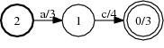
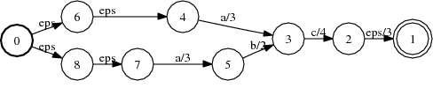

# ShortestPath

## Description

This operation produces an FST containing the $n$-shortest paths in the input
FST. The $n$-shortest paths are the $n$-lowest weight paths w.r.t. the
natural semiring order. The single path that can be read from the $i$-th of at
most $n$ transitions leaving the initial state of the resulting FST is the
$i$-th shortest path.

The weights need to be right distributive and have the
[path](weight_requirements.md) property. They also need to be left distributive
as well for $n$-shortest with $n > 1$ (valid for `TropicalWeight`).

## Usage

```cpp
template<class Arc>
void ShortestPath(const Fst<Arc> &ifst, MutableFst<Arc> *ofst, size_t n = 1);
```

```bash
fstshortestpath [--opts] a.fst out.fst
    --nshortest: type = int64, default = 1
      Return N-shortest paths
    --unique: default = false
      Return only distinct strings (NB: must be acceptor; epsilons treated as regular symbols)
```

## Examples

### A:


(TropicalWeight)

### Shortest path in A:



### 2-shortest paths in A:



## Complexity

`ShortestPath:`

*   **1-shortest path:**

*   Time: $O(V \log V + E)$

*   Space: $O(V)$

*   **n-shortest paths:**

*   Time: $O(V \log V + n V + n E)$

*   Space: $O(n V)$

where $V$ = # of states and $E$ = # of arcs. See
[here](efficiency.md#algorithm-specific-issues) for more discussion on
efficiency.

## Caveats

See [here](efficiency.md#algorithm-specific-issues) for a discussion on
efficient usage.

## See Also

[ShortestDistance](shortest_distance.md),
[State Queues](advanced_usage.md#state-queues)

## References

*   Mehryar Mohri.
    [Semiring Framework and Algorithms for Shortest-Distance Problems](http://www.cs.nyu.edu/~mohri/postscript/jalc.ps),
    *Journal of Automata, Languages and Combinatorics*, 7(3):321-350, 2002.
*   Mehryar Mohri and Michael Riley.
    [An Efficient Algorithm for the n-best-strings problem](http://www.cs.nyu.edu/~mohri/postscript/nbest.ps),
    In *Proceedings of the International Conference on Spoken Language
    Processing 2002 (ICSLP '02)*.
