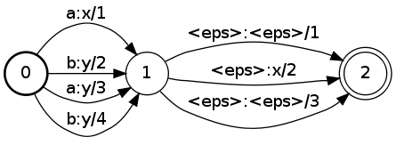
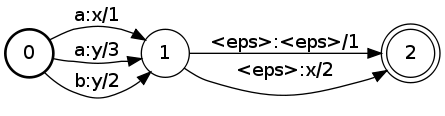

# StateMap

## Description

This operation transforms each state in the input FST. The transformation is
specified by a function object called a *state mapper*.

For instance, `ArcSumMapper`
[`arc_sum_mapper`](https://www.openfst.org/doxygen/fst/html/structfst_1_1_arc_sum_mapper.html)
combines arcs with the same input label, output label and destination state,
⊕-summing their weights.

A list of available state mappers and instructions on how to create them are
given [here](advanced_usage.md#state-mappers).

## Usage

```cpp
template <class Arc, class StateMapper>
StateMap(MutableFst<Arc> *fst, StateMapper *mapper);
```

```cpp
template <class Arc, class StateMapper>
StateMap(MutableFst<Arc> *fst, StateMapper mapper);
```

```cpp
template <class Arc, class StateMapper>
StateMap(const Fst<Arc> &ifst, MutableFst<Arc> *ofst, StateMapper *mapper);
```

```cpp
template <class Arc, class StateMapper>
StateMap(const Fst<Arc> &ifst, MutableFst<Arc> *ofst, StateMapper mapper);
```

```cpp
template <class Arc, class StateMapper> StateMapFst<Arc>::
StateMapFst(const Fst<A> &fst, StateMapper *mapper);
```

[`StateMapFst`](https://www.openfst.org/doxygen/fst/html/classfst_1_1StateMapFst.html)

```cpp
template <class Arc, class StateMapper> StateMapFst<Arc>::
StateMapFst(const Fst<A> &fst, const StateMapper &mapper);
```

```bash
fstmap [--opts] in.fst out.fst
     -map_type (Map operation, one of: "identity", "arc_sum") type: string default: "identity"
    -weight (Weight parameter) type: string default: ""
```

Note `fstmap` also includes [arc mappers](arc_map.md).

## Example

### A:



(TropicalWeight)

### StateMap(&A, ArcSumMapper(A)):



```bash
StateMap(&A, ArcSumMapper<StdArc>(A));
StateMap(A, &B, ArcSumMapper<StdArc>(A));
StateMapFst B(A, ArcSumMapper<StdArc>(A));

fstmap --map_type=arc_sum a.fst b.fst
```

## Complexity

`StateMap:`

*   Time: $O(c \cdot V)$
*   Space: $O(m)$

where $V$ = # of states, $c$ = cost of processing one state by the mapper
and $m$ = total memory usage for the mapper.

`StateMapFst:`

*   Time: $O(c \cdot v)$
*   Space: $O(m)$

where $v$ = # of visited states, $c$ = cost of processing one state by the
mapper and $m$ = total memory usage for the mapper. Constant time and space to
visit an input state is assumed and exclusive of
[caching](advanced_usage.md#caching).

For instance in the case of `ArcSumMap`, we have $c = O(D \log(D))$ and $m =
O(D)$, where $D$ = maximum out-degree.

## See Also

[ArcMap](arc_map.md), [State Mappers](advanced_usage.md#state-mappers)
