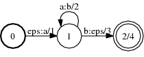
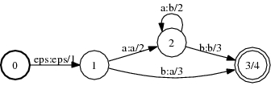

# Synchronize

## Description

This operation synchronizes a transducer. The result will be an
[equivalent](glossary.md#equivalent) FST that has the property that during the
traversal of a path, the *delay* is either zero or strictly increasing, where
the delay is the difference between the number of non-epsilon output labels and
input labels along the path.

For the algorithm to terminate, the input transducer must have bounded delay,
*i.e.*, the delay of every cycle must be zero.

## Usage

```cpp
template <class Arc>
void Synchronize(const Fst<Arc> &ifst, MutableFst<Arc> *ofst);
```

```cpp
template <class Arc> SynchronizeFst<Arc>::
SynchronizeFst(const Fst<Arc>& fst);
```

[`SynchronizeFst`](https://www.openfst.org/doxygen/fst/html/classfst_1_1SynchronizeFst.html)

```bash
fstsynchronize a.fst out.fst
```

## Examples

### A:



### Synchronize of A:



```bash
Synchronize(A, &B);
SynchronizeFst<Arc>(A);
fstsynchronize a.fst out.fst
```

## Complexity

`Synchronize`:

*   `A` has bounded delay: Time and Space complexity is *exponential*
*   `A` does not have bounded delay: *does not terminate*

`SynchronizeFst`:

*   `A` has bounded delay: Time and Space complexity is *exponential*
*   `A` does not have bounded delay: *does not terminate*

## References

*   Mehryar Mohri.
    [Edit-Distance of Weighted Automata: General Definitions and Algorithms](http://www.cs.nyu.edu/~mohri/postscript/edit.pdf),
    *International Journal of Computer Science*, 14(6): 957-982 (2003).
