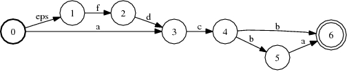

# Topsort

## Description

This operation topologically sorts its input if acyclic, modifying it.
Otherwise, the input is unchanged. When sorted, all transitions are from lower
to higher state IDs.

## Usage

```cpp
template<class Arc>
void TopSort(MutableFst<Arc> *fst);
```

```bash
fsttopsort a.fst out.fst
```

## Examples

### A:


### Topsort of A:



```bash
Topsort(&A);
fsttopsort a.fst out.fst
```

## Complexity

`Topsort`:

*   Time: $O(V + E)$
*   Space: $O(V + E)$

where $V$ = # of states and $E$ = # of arcs.
