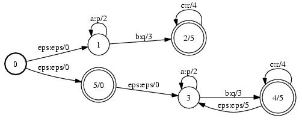

# Union

## Description

This operation computes the union (*sum*) of two FSTs. If `A` transduces string
`x` to `y` with weight `a` and `B` transduces string `w` to `v` with weight `b`,
then their union transduces `x` to `y` with weight `a` and `w` to `v` with
weight `b`.

## Usage

```cpp
template <class Arc>
void Union(MutableFst<Arc> *fst1, const Fst<Arc> &fst2);
```

```cpp
template <class Arc> UnionFst<Arc>::
UnionFst(const Fst<Arc> &fst1, const Fst<Arc> &fst2);
```

[`UnionFst`](https://www.openfst.org/doxygen/fst/html/classfst_1_1UnionFst.html)

```bash
fstunion a.fst b.fst out.fst
```

## Examples

### A:


### B:


### A ∪ B:



```bash
Union(&A, B);
UnionFst<Arc>(A, B);
fstunion a.fst b.fst out.fst
```

## Complexity

`Union`:

*   Time: $O(V_2 + E_2)$
*   Space: $O(V_2 + E_2)$

where $V_i$ = # of states and $E_i$ = # of arcs of the *ith* FST.

`UnionFst:`

*   Time: $O(v_1 + e_1 + v_2 + e_2)$
*   Space: $O(v_1 + v_2)$

where $v_i$ = # of states visited and $e_i$ = # of arcs visited of the *ith*
FST. Constant time and space to visit an input state or arc is assumed and
exclusive of [caching](advanced_usage.md#caching).
